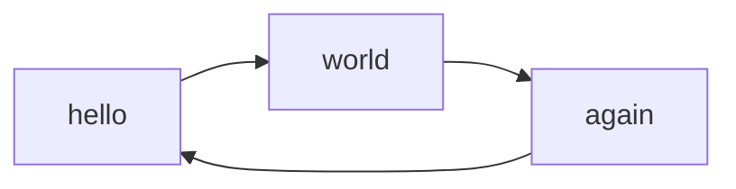

# RENDER MARKDOWN EN PRUEBAS

## TITULO 01
### Subtitulo 01
Aqui va otro `codigo` pendiente

---

## Presione las siguientes teclas


SHORTCUT | KEY
-|-
++ctrl+alt+n++ | UP


---

## TASKLIST

- [ ] uno
- [ ] dos
- [X] tres


---

## MATH

$$
X = \frac{12}{X}
$$

$X = Y^2$

---

## ENLACES

IR [AQUI](about.md#tabla-01) o [AQUI](guia01/index.md#es-decir)

---

## Callouts

!!! info "ATENCION"
    hola a todos
    conociendo `OK`
    ```python
    print(x)
    ```

!!! warning "ATENCION"
    hola a todos
    conociendo `OK`

!!! tip "ATENCION"
    hola a todos
    conociendo `OK`

!!! error "ATENCION"
    hola a todos
    conociendo `OK`

---

## Código programación

```py
nombre = input("escriba su nombre: ")
print(nombre)
```

Código en línea así `perro` ok `bitche`



---

## LISTAS

### no ordenadas
+ uno
+ dos
+ tres

### ordenadas

1. uno
2. dos
3. tres

---

## Enlaces

Esto es un ejemplo de [enlace](https://jfkennedy.edu.co)

---

## Imágenes


---

## Quotes (No funcionan...)

> *"Pertenece así, no debería se así"*

---

## Tabla 01

titulo1 | titulo2 | titulo3
-|-|-
hola | hola | 
`hola`|$X$|


---
## TABS
/// tab | Tab 1 title
Tab 1 content
///

/// tab | Tab 2 title
Tab 2 content
///